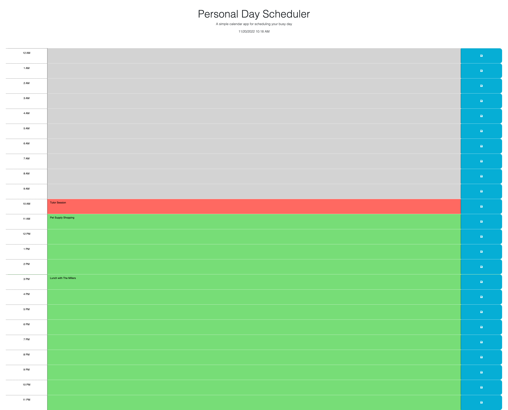

# aide_memoire
An aide tool to organize your daily activities

## Description

A daily planner - add and edit events throughout the day. The scheduled time blocks are color coded to give a quick indicator if the time block is in the past, present or future.  

## Usage
Deployed code at [Aide Memoire](https://savannahvel.github.io/aide_memoire/)

## Credits
[Starter Code](https://github.com/coding-boot-camp/crispy-octo-meme)

## License
Please refer to the LICENSE in the repo.